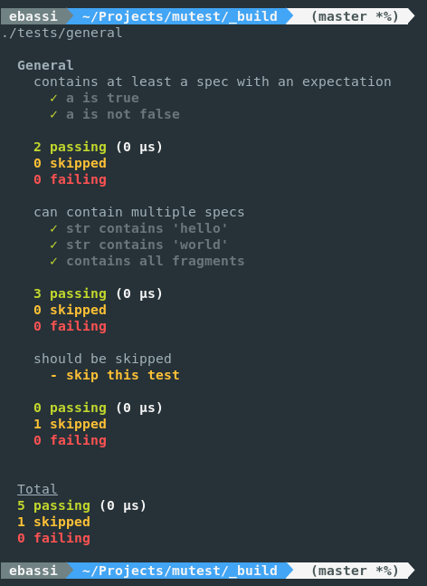
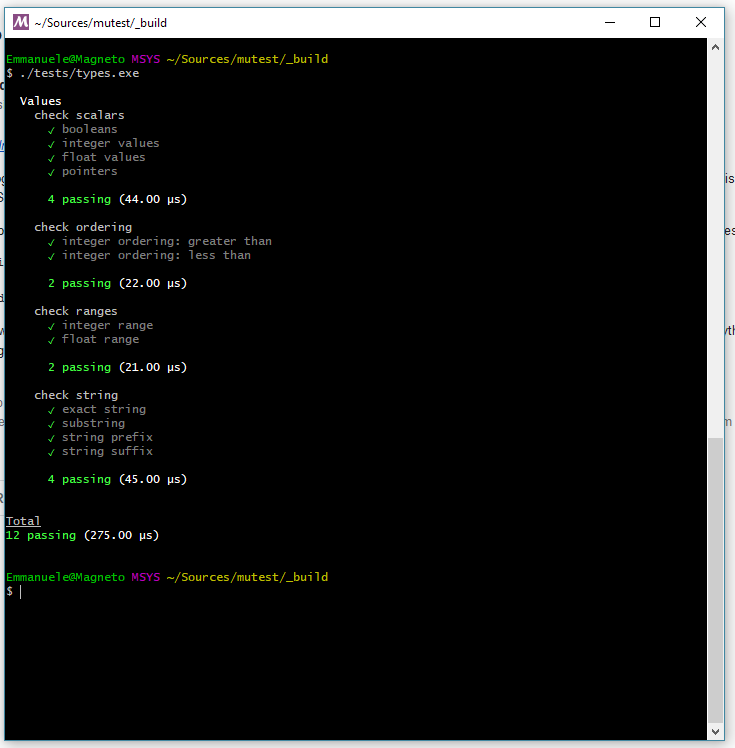

## µTest - A small C testing library

 - **Linux**: [](https://travis-ci.org/ebassi/mutest)
 - **Windows**: [](https://ci.appveyor.com/project/ebassi/mutest/branch/master)
 - [](https://coveralls.io/github/ebassi/mutest?branch=master)

## What is µTest

µTest aims to be a small unit testing library for C projects, with an API
heavily modelled on high level [Behavior-Driver Development][bdd] frameworks
like [Jasmine][jasminejs] or [Mocha][mochajs].

µTest is written in C99, and can be used on multiple platforms.

### Features

 - Small API footprint
 - Easy to use
 - Portable
 - Zero dependencies
 - Supports [TAP](https://testanything.org)

### Screenshot





[bdd]: https://en.wikipedia.org/wiki/Behavior-driven_development
[jasminejs]: https://jasmine.github.io/
[mochajs]: https://mochajs.org/

**WARNING**: µTest's API is still in flux!

---

## Getting Started

### Building µTest

Simply clone this repository, and use [Meson](http://mesonbuild.com) to
generate the appropriate build instructions:

```sh
$ git clone https://github.com/ebassi/mutest.git
$ cd mutest
$ meson _build .
$ cd _build
$ ninja
$ meson test
$ sudo ninja install
```

### Using µTest

The documentation of µTest is [available online](https://ebassi.github.io/mutest/mutest.md.html).

### Contributing

See the [Contribution guide](./CONTRIBUTING.md).

## License

µTest is released under the terms of the [MIT](./LICENSE.txt) license.
